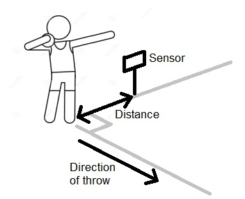
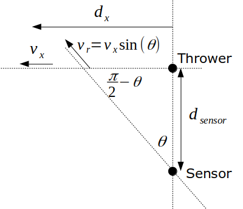

# Garmin Challenge 2021 Solution

This repository shows my solution to the Garmin Challenge 2021 used as a techinical challenge for thier job applicaiton. The challenge instructions were as follows:

> "
> During a hackathon at Garmin Stellenbosch, you and your teammates are experimenting with sonic sensors for
> athletic events like shot-put and javelin.You've managed to put together a system that can transmit a
> sound signal at the projectile being thrown, and record the return signal that reflects off it.

> Attached are the transmitted signal that is used for all projectiles, and the received signals for a shot-put
> and a javelin throw. Can you calculate the speed at which each projectile was thrown?

> BONUS: Can you estimate how far the sonic sensor was off to the side of the thrower in each case (see
> attached diagram)?
> "

It can be assumed that the sonic sensor is placed perpendicular to the thrower at some unkown distance to the thrower.

# Approach
Due to the Dopler effect, the frequency of the received wave will change depending on the velicity of the object. Therefore, using the change in frequency of the sound wave, the radial velocity can be determined. 

The frequency content of the received signal can be determined using the Fourier tansform. The Fourier transform does however not carry any time information. This is required if we are to plot the radial velicity with time. This can be achieved by windowing the sampled signal into frames (segments of samples) where each frame is approximately stationary. This is called the Short-Time Fourier transform. In my solution, this is plotted using a color map (or spectogram), where the colour shows the amplitude dimension. We are only interested in frequency where the maximum amplitude (or power) occurs since the other frequencies can be considered noise in the signal (since the transmitted signal was at a single frequency).

Since we do not know the distance of the sonic sensor from the thrower, we can not determine the velocity component in the direction of the thrower without making an assumption. Considering the plot of the velocity vs time, the velocity remains fairly constant after an initial accelleration. Assuming that at the time this happens, the distance of the projectile from the thrower is much larger than the distance of the sonic sensor from the thower, the component of the radial velocity in the direction of the thrower would be approximately equal to the radial velocity (theta in the diagram would be large).

Further assuming the deceleration of the projectile in the direction of the thrower is neglegable (since only a short time has ellapsed), the initial velocity would be approximately equal to the radial velocty at the points where the radial velocity remain constant. 

Using geomery (below diagram), the estimated distance of the sonic sensor from the thrower can be plotted.

**The full solution and results are shown in Solution.ipynb**

**A printout of the Jupyter Notebook is shown in Solution.html**

